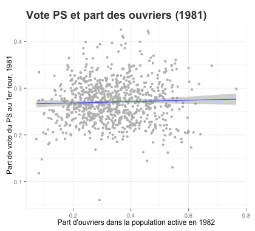
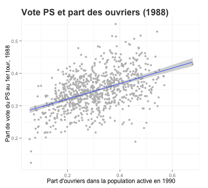
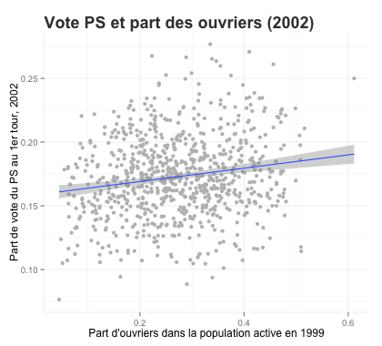
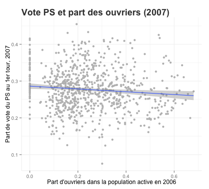
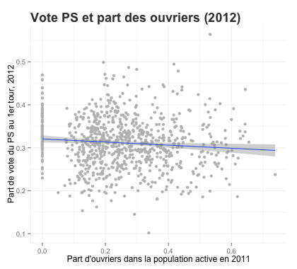
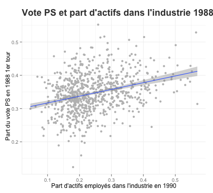
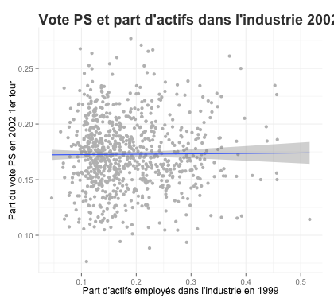
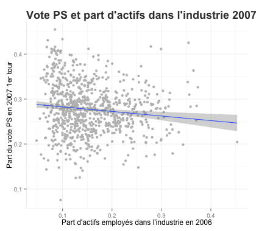
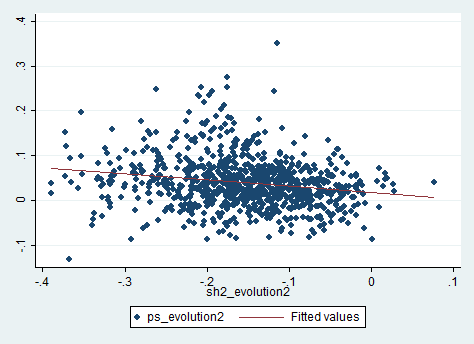
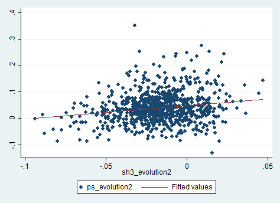

# Données socio-démographiques et comportement électoral

* [pad du projet](https://lite5.framapad.org/p/cspvote)

## Données utilisées

* [Données du recensement sur le secteur d'activité de la population active par commune](http://www.insee.fr/fr/themes/detail.asp?reg_id=99&ref_id=pop-act-csp-dipl) 
* Données sur les élections présidentielles par commune : 
	* 1981-1988 pour les communes de plus de 9000 https://www.data.gouv.fr/fr/datasets/elections-presidentielles-1965-2012-1/
	* Pour toutes les communes 
		* [1995](https://www.data.gouv.fr/fr/datasets/election-presidentielle-1995-resultats-572085/)
		* 2002, [tour 1](https://www.data.gouv.fr/fr/datasets/election-presidentielle-2002-resultats-572116/), [tour 2](https://www.data.gouv.fr/fr/datasets/election-presidentielle-2002-resultats-572118/)
		* [2007](https://www.data.gouv.fr/fr/datasets/election-presidentielle-2007-resultats-572122/)
		* [2012](https://www.data.gouv.fr/fr/datasets/election-presidentielle-2012-resultats-572126/)

On apparie les données en fonction du recensement le plus proche
* l'élection de 1981 est appariée au recensement de 1982
* l'élection de 1988 est appariée au recensement de 1990
* l'élection de 2002 est appariée au recensement de 1999
* l'élection de 2007 est appariée au recensement de 2006
* l'élection de 2012 est appariée au recensement de 2011

## Effet par commune de la part d'ouvriers dans la population active sur le vote PS

## Effet par commune de la part de la population active travaillant dans l'industrie sur le vote PS

## Effet de l'évolution du secteur d'activité sur l'évolution du vote PS entre 1981 et 2012

Agriculture

Industrie

BTP

Tertiaire

